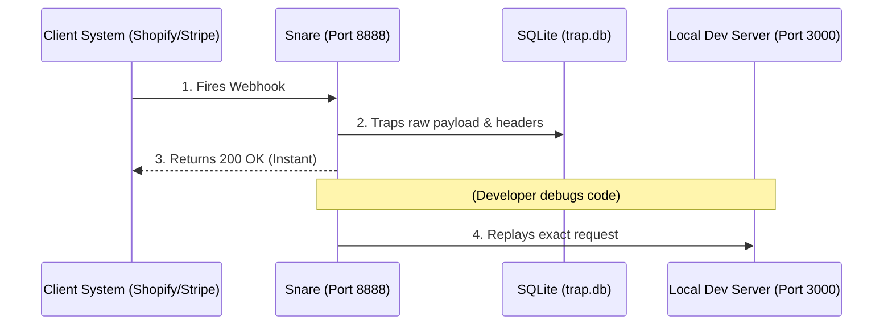

# Snare: Examples & Usage

Snare acts as a local "black hole" to capture chaotic webhooks from third-party systems, allowing you to replay them locally during backend development.

## The Architecture



---

## Example Lifecycle

### Step 1: Set the Trap
Start the Snare listener in the background (or in a dedicated terminal pane).
```bash
$ snare listen --port 8888
🎧 Listening for webhooks on http://localhost:8888
```

### Step 2: The Client Fires a Webhook
A chaotic client system sends a payload with custom headers. Snare catches it.
```bash
🪤 Trapped: [POST] /api/v1/webhook?source=stripe (66 bytes)
```

### Step 3: Inspect the Traps
List all recently captured requests.
```bash
$ snare list

Recent Traps:
 ID     Method    Path                            Size        Time                 
───────────────────────────────────────────────────────────────────────────────────
 2      GET       /ping?                          0B          16 Jul 26 04:53 UTC  
 1      POST      /api/v1/webhook?source=stripe   66B         16 Jul 26 04:53 UTC  
```

### Step 4: Replay Against Local Dev
Now that you have written your ingestion code in `client-systems`, you can replay the exact webhook against your running backend to test it safely.
```bash
$ snare replay --id 1 --target http://localhost:3000

🔄 Replaying request to: http://localhost:3000/api/v1/webhook?source=stripe
✅ Target responded with Status: 201
Body: {"message": "Ingestion successful"}
```
